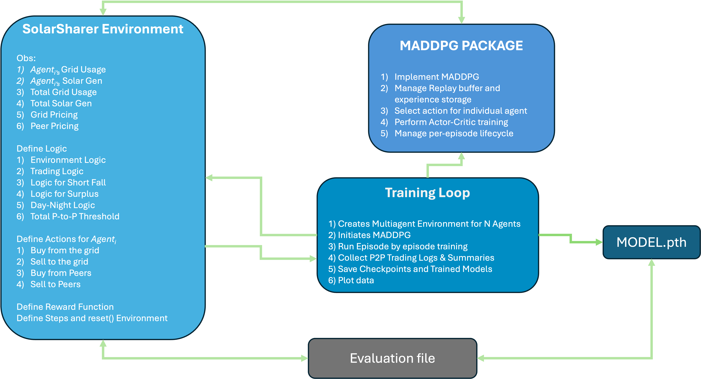

# SolarSharer

SolarSharer is a decentralized, multi-agent environment for simulating peer-to-peer solar energy trading across multiple houses, with the goal of making energy distribution fairer, more stable, and more sustainable. Built on an OpenAI Gym interface, it models the dynamic, decentralized nature of Virtual Power Plants (VPPs) and supports reward shaping, step/observation spaces, and action spaces tailored for P2P energy markets.

SolarSharer stands out by effectively managing both the non-stationarity among multiple learning agents and the complexities of continuous action spaces—leading to significantly improved fairness, stability, and efficiency in decentralized solar energy trading.

We provide a main environment file, `solar_sharer_env.py`, which contains the core logic—from the reward function to the reset and step methods. The accompanying MADDPG folder and experiments scripts illustrate how to train using Multi-Agent Deep Deterministic Policy Gradient, with pointers on hyperparameter tuning. In addition, the codebase shows how to adapt other RL algorithms such as PPO, Policy Gradient, Independent DQN, or even Round Robin scheduling. By following these steps, you can integrate any multi-agent RL method and extend the environment to tackle more sophisticated, nonstationary scenerios in VPP systems.




## Overview
#### 1. The SolarSharer Environment
Location: `solar_sharer_env.py`

Purpose: Simulates a group of residential solar prosumers and consumers, tracking each agent’s demand, solar generation, and potential trades.

Key Methods:

`__init__()`: Loads and preprocesses real-world energy data, sets up spaces, reward parameters, etc.

`reset()`: Resets the environment to a new day’s data (or random day) and returns the initial observation for each agent.

`step(actions)`:

Validates continuous actions (buy/sell from grid or peers).

Calculates how much each agent imports or exports.

Applies a reward function balancing cost savings, fairness, and more.

Returns (new_observations, rewards, done, info) just like any other Gym environment.

Reward Function: A multi-objective formulation encouraging minimal grid reliance, active peer-to-peer participation, and fairness (via Jain’s Index).

### 2 Multi-Agent RL

To demonstrate that **SolarSharer** works with different approaches, we include **separate folders** for each algorithm. Each folder contains:
- **Training scripts** (e.g., `train.py`),
- **Agent definitions** (e.g., `maddpg.py`, `independent_dqn_agent.py`, etc.),
- **Evaluation scripts** (e.g., `eval_independent_dqn.py`).

#### Experiments Folder
The **main training, evaluation, and testing files** reside under the `experiments/` directory. These files focus primarily on **MADDPG**. 

#### MADDPG Folder
Inside the `maddpg/` directory, you will find:
- `maddpg.py`
- `replay_buffer.py`
- `distribution.py`
- `tf_util.py`

These files collectively implement the **Multi-Agent Deep Deterministic Policy Gradient** algorithm.

#### Other Algorithms
For **all other algorithms** (e.g., PPO, Policy Gradient, Independent DQN), their **training and evaluation scripts** are in their **respective folders** (e.g., `ppo/`, `pg/`, `IDQN/`). All these scripts are **based on** the structure of the **main** `train.py` (found in `experiments/`) and **mirror** its implementation style, but each uses a **different set of algorithms** or learning paradigms.


### 3. Installation & Environment Setup
Clone or copy the repository:

bash

```bash

python3 -m venv venv
source venv/bin/activate

```
Install required packages:
```bash
pip install --upgrade pip
pip install -r requirements.txt
```

(Optional) GPU Setup:

If you want to use CUDA, ensure PyTorch is installed with GPU support and that you have the necessary drivers.

If you see “No GPU detected” logs, it’ll run on CPU.

## Extending `train.py` to Other Algorithms

Below is a concise explanation of how to modify `train.py` (or any similar script) to train **any new algorithm** on the **SolarSharer** environment.  

The **SolarSharer** environment (`solar_sharer_env.py`) provides a **Gym-like interface** (`reset()`, `step()`, etc.). This means you can **plug in any algorithm**—beyond MADDPG or PPO—by following these general steps:

### 1. Initialize the Environment
```python
env = SolarSharer(
    data_path="data/filtered_pivoted_austin.csv",
    alpha=0.3, 
    beta=0.5, 
    gamma=0.5, 
    delta=0.4,
    max_grid_price=0.2112
)
```
Determine the number of agents (env.num_agents).

Query your observation/action spaces (env.observation_space, env.action_space).

### 2. Define Your Algorithm’s Policy and Update Procedure
Create a model class (e.g., MyAlgorithmPolicy) that will select actions based on environment observations.

Prepare a replay buffer or rollout buffer if your method requires it.

Implement the training routine  `train_ppo.py` or `pg_train.py`.

### 3. Main Training Loop
```python

for episode in range(num_episodes):
    obs = env.reset()  # Reset environment
    done = False
    total_reward = np.zeros(env.num_agents, dtype=np.float32)

    while not done:
        actions = my_policy(obs)  
        next_obs, rewards, done, info = env.step(actions)

        # (Optional) Store transitions in a buffer for off-policy methods
        my_algorithm.store_transition(obs, actions, rewards, next_obs, done)

        # Perform any needed updates
        my_algorithm.train(batch_size=batch_size)

        obs = next_obs
        total_reward += rewards

```
Each iteration, you compute actions for all agents, step the environment, gather rewards, and store data. Remember that we are storing all of this for our evaluation later.

### 4. Logging & Saving
Keep track of rewards, losses, and additional metrics (e.g., peer-to-peer trading info). We are also maping out each agents reward for evaluating how quickly individual agents converge to a stable policy.

Save models and checkpoints at desired intervals (e.g., after every N episodes) or when the mean reward improves. We save trained model, best model and checkpoints. So for every training loop you should see `maddpg_best.pth` , `maddpg_trained.pth` or `pg_best.pth`, `pg_trained.pth`, `pg_checkpoint_500.pth` etc.

### 5. Example: Converting train.py to a New Algorithm
Copy the skeleton of train.py (or train_ppo.py).

Replace the agent creation call (maddpg = MADDPG(...)) with your custom algorithm (e.g., dqn_agent = MyDQN(...)).

Adapt the “select action” and “train” lines:

``` python

actions = my_algorithm.select_actions(obs)
next_obs, rewards, done, info = env.step(actions)
my_algorithm.store_transition(obs, actions, rewards, next_obs, done)
my_algorithm.train(batch_size=batch_size)
```
Reuse any logging, plotting, or checkpoint code that fits your workflow.

Because SolarSharer strictly follows Gym conventions, you only need to ensure that your new algorithm accepts the same observation, action, and reward structure used by train.py


## Additional Resources for reference

Below are links and articles that might help with **hyperparameter tuning**, **theoretical insights**, and **practical guidelines** for various multi-agent RL algorithms used within this project. Since our environment is **strictly designed for multi-agent settings**, be cautious when configuring parameters—many standard single-agent defaults may not apply directly.

---

### 1. Multi-Agent Deep Deterministic Policy Gradient (MADDPG)
For an in-depth explanation or theoretical background:
- **Official Documentation**: [github.com/openai/maddpg](https://github.com/openai/maddpg)
- **Video Overview**: [YouTube - MADDPG Guide](https://youtu.be/tZTQ6S9PfkE?si=t5I1N9sI1l2FDNTJ)

---

### 2. Deep Q-Network (DQN)
Helpful resources for **hyperparameter tuning** and practical DQN insights:
- **PyTorch Tutorial**: [pytorch.org/tutorials DQN](https://pytorch.org/tutorials/intermediate/reinforcement_q_learning.html)
- **Extended Guide**: [pytorch.org/rl/stable/coding_dqn](https://pytorch.org/rl/stable/tutorials/coding_dqn.html)

---

### 3. Proximal Policy Optimization (PPO)
For **implementation details** and **hyperparameter selection** in PPO:
- **PyTorch Tutorial**: [pytorch.org/tutorials/intermediate/reinforcement_ppo.html](https://pytorch.org/tutorials/intermediate/reinforcement_ppo.html)
- **Beginner-Friendly Repo**: [github.com/ericyangyu/PPO-for-Beginners](https://github.com/ericyangyu/PPO-for-Beginners)

---

### 4. Policy Gradient Methods
Introductory materials on **policy gradient** (and how you might adapt it for multi-agent setups):
- **OpenAI Spinning Up**: [spinningup.openai.com VPG](https://spinningup.openai.com/en/latest/algorithms/vpg.html)
- **PyTorch Notebook**: [github.com/tsmatz RL tutorials (Policy Gradient)](https://github.com/tsmatz/reinforcement-learning-tutorials/blob/master/02-policy-gradient.ipynb)

---

### Other Relevant Sources
- **Gymnasium (OpenAI Gym) Docs**: [gymnasium.farama.org](https://gymnasium.farama.org/)

## Conclusion

Thank you for exploring **SolarSharer** and its multi-agent reinforcement learning framework. We hope this environment and the accompanying training scripts help accelerate your research and development. If you have any questions, suggestions, or encounter any issues, please feel free to **open an issue** or **contact us directly** anany.p.gupta-1@ou.edu . We value your feedback. Thankyou!


